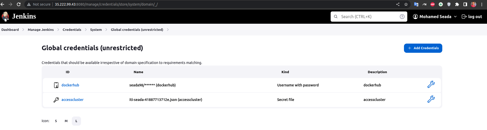
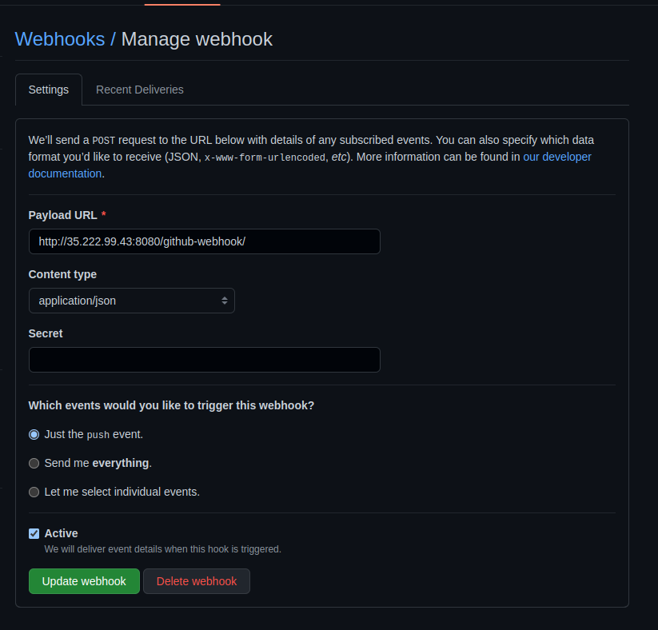
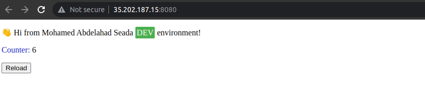

# Jenkins CI/CD Pipeline To Build and Deploy a Pythn App

### Jenkins application running as a pod on a GKE cluster (Google Cloud Platform resource) which is used to build and deploy a Hello World python app.


### This project is based on an infrastructure repository: 

https://github.com/seada98/ITI-Final-Project-Infrastructure

## Illustrations & Setup

### Jenkins Credentials Configurations:
- Create a credential for your Dockerhub account.
- Secret file credentials that contains the VM service account key pair file in order to have access to the cluster.



### Dockerfile

Created a Dockerfile to Dockerize My Python App

### Jenkinsfile

Created a Jenkinsfile with continuous integration (CI) and continuous deployment (CD) stages

#### CI stage:
 
- Building the image with a version number equals to the Jenkins build number. 
- Passing the Dockerhub credentials in order to login.
- Pushing the new image to Dockerhub.

BUILD_NUMBER is an environment variable.

#### CD stage:

- Passing the service account credentials to connect to the cluster.
- Replacing the "tag" in the deployment file with the new BUILD_NUMBER (version).
- Deploying the app with kubectl.

When the pipeline finishes building, the app will be deployed on the GKE cluster based on this repository:
https://github.com/seada98/ITI-Final-Project-Infrastructure

### Create New Pipeline With Pipeline script from SCM

- Choose type for SCM (Git) , Put Your Repository Link
- If The Repo Private We Need Add Credential Github Username And Password
- Check Branch Name In Your Repo

#### GitHub Webhook

Changing the pipeline configurations by activating the "GitHub hook trigger for GITScm polling".


From GitHub -->
- Add a webhook.
- Add the jenkins URL/github-webhook/ to the Payload URL.



### Voila! The application is successfully deployed!🚀 



## Final Part: Clean up 💣
```
terraform destroy 
```